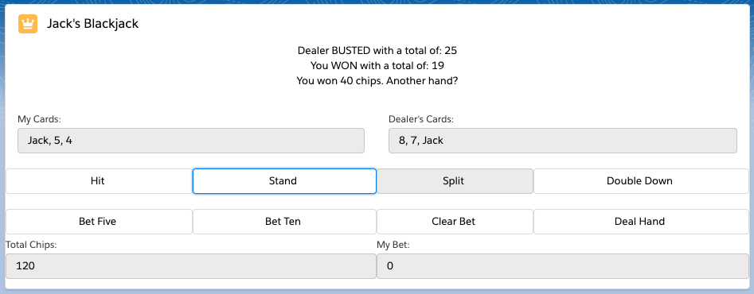

# BlackjackLWC
Simple Blackjack LWC, drops right into Salesforce page layout

Goal of the game: Beat the dealer by getting as close to 21 without going over

Rules:
- Deal Hand: deals two cards to the player and one to the dealer, starts the round, locks bets
- Hit: deals another card to the player
- Stand: locks the player's hand and determines outcome of the round
- Double Down: doubles the bet, deals one card to the player, and stands
- All bets are in increments of 5 and 10
- Player starts with 100 chips
- Dealer stands on 17  
- Blackjack pays 3:2  
- In the event of a tie, you recieve your initial bet amount back
- Aces are always counted as 11 (for now)  
- Can't split your hand (for now)  

